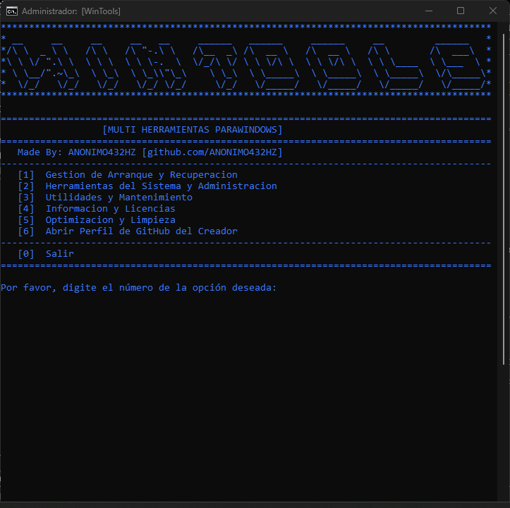
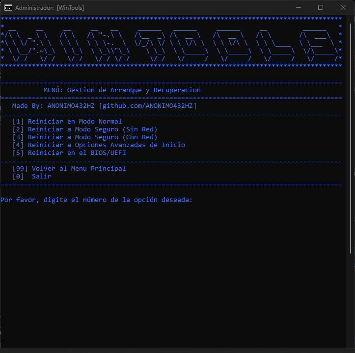
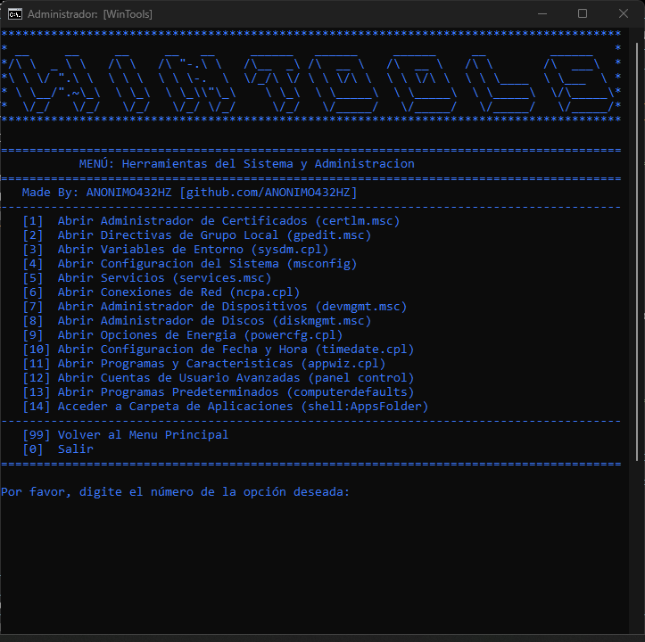
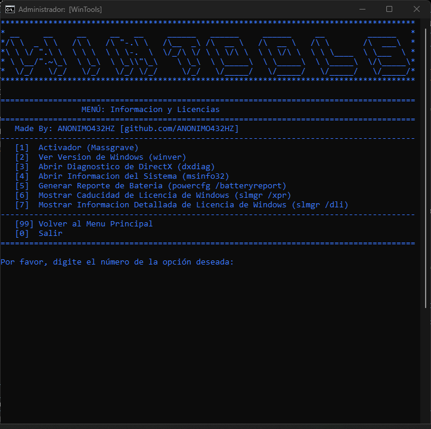
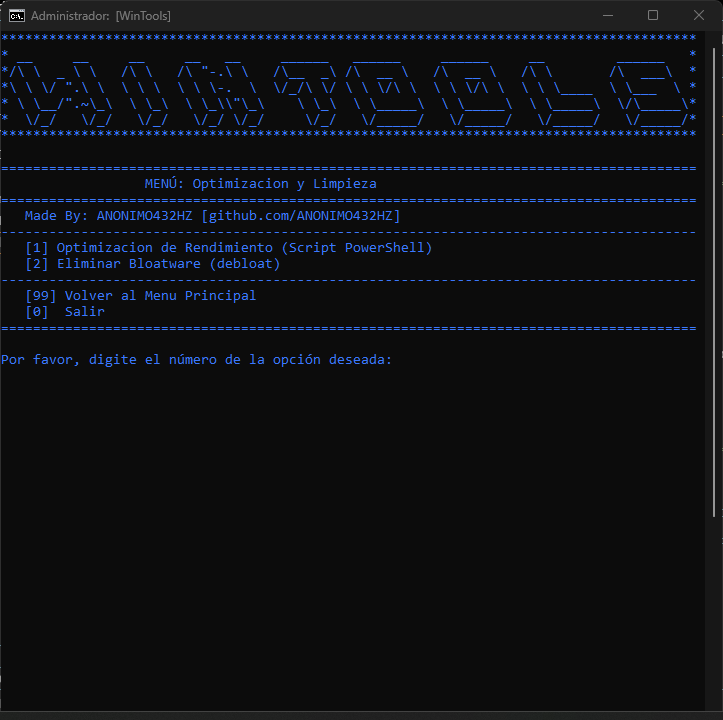
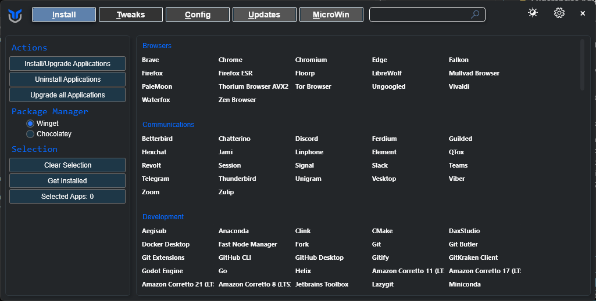
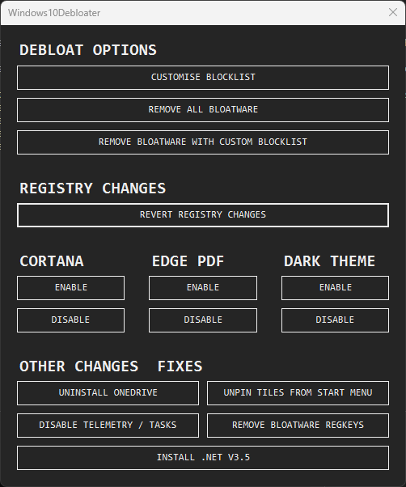

# 🛠️ WinTools

<div align="center">


**Una colección completa de herramientas de administración y optimización para Windows**   

[🚀 Instalación Rápida](#-instalación-rápida) • [✨ Características](#-características) • [🔧 Uso](#-uso) • [📋 Menús](#-menús)

</div>

---

## 📖 Descripción

**WinTools** es una herramienta integral de administración y optimización para Windows que combina múltiples utilidades del sistema en una interfaz unificada y fácil de usar. Diseñada para administradores de sistemas, técnicos de soporte y usuarios avanzados, proporciona acceso rápido a herramientas esenciales de Windows.

### 🎯 ¿Por qué WinTools?

- 🔧 **Herramientas del Sistema**: Acceso directo a utilidades administrativas de Windows
- 🚀 **Gestión de Arranque**: Control completo sobre el arranque y recuperación del sistema
- 🛡️ **Optimización**: Scripts de optimización y limpieza del sistema
- 📊 **Información del Sistema**: Monitoreo y diagnóstico completo
- 🎨 **Interfaz Intuitiva**: Menú organizado y fácil navegación
- ⚡ **Elevación Automática**: Solicita privilegios de administrador automáticamente

---

## ✨ Características

### 🔧 **Gestión de Arranque y Recuperación**
- 🔄 **Modo Normal**: Restauración del arranque estándar
- 🛡️ **Modo Seguro**: Reinicio a modo seguro con y sin red
- ⚙️ **Opciones Avanzadas**: Acceso a opciones de inicio avanzadas
- 🔌 **BIOS/UEFI**: Reinicio directo a la configuración del firmware

### 🛠️ **Herramientas del Sistema y Administración**
- 📋 **Administrador de Certificados**: Gestión de certificados digitales
- ⚙️ **Directivas de Grupo**: Configuración de políticas locales
- 🌍 **Variables de Entorno**: Gestión de variables del sistema
- 🔧 **Configuración del Sistema**: Control de inicio y servicios
- 🖥️ **Servicios**: Administración de servicios de Windows
- 🌐 **Conexiones de Red**: Configuración de red
- 🔌 **Administrador de Dispositivos**: Gestión de hardware
- 💾 **Administrador de Discos**: Gestión de almacenamiento
- ⚡ **Opciones de Energía**: Configuración de energía
- 🕐 **Fecha y Hora**: Configuración temporal
- 📦 **Programas y Características**: Gestión de software
- 👤 **Cuentas de Usuario**: Administración de usuarios
- 🎯 **Programas Predeterminados**: Configuración de aplicaciones

### 🧹 **Utilidades y Mantenimiento**
- 🛡️ **Windows Defender**: Escaneo rápido del sistema
- 🔑 **BitLocker**: Recuperación de claves de cifrado
- 📦 **Instalador CTT**: Script de Chris Titus Tech
- 🚀 **Ninite**: Instalador de programas populares
- ⌨️ **Teclado en Pantalla**: Accesibilidad
- 📹 **Grabador de Pasos**: Documentación de problemas
- 🧹 **Limpieza de Disco**: Optimización de espacio
- 📁 **Explorador**: Acceso rápido al sistema de archivos

### 📊 **Información y Licencias**
- 🔓 **Activador Massgrave**: Activación de Windows
- ℹ️ **Información del Sistema**: Diagnóstico completo
- 🎮 **DirectX**: Información de gráficos
- 🔋 **Reporte de Batería**: Estado de la batería
- 📄 **Licencias**: Información de licencias de Windows

### ⚡ **Optimización y Limpieza**
- 🚀 **Optimización de Rendimiento**: Scripts de mejora del sistema
- 🗑️ **Eliminación de Bloatware**: Limpieza de software innecesario

---

## 🚀 Descarga Rápida

### 📦 Última Versión Estable

- **Windows 32-bit**: [WinTools_x32.exe](https://github.com/ANONIMO432HZ/WinTools/releases/latest/download/WinTools_x32.exe)
- **Windows 64-bit**: [WinTools_x64.exe](https://github.com/ANONIMO432HZ/WinTools/releases/latest/download/WinTools_x64.exe)
- **Script Original**: [WinTools.bat](https://github.com/ANONIMO432HZ/WinTools/raw/main/WinTools.bat)

### 📋 Instalación

1. **Descarga** el archivo correspondiente a tu sistema
2. **Ejecuta como administrador** (clic derecho → "Ejecutar como administrador")
3. **¡Listo!** El programa solicitará privilegios automáticamente

### ⚠️ Nota sobre Antivirus

Los ejecutables pueden ser detectados por Windows Defender. Ver [SOLUCION_ANTIVIRUS.md](SOLUCION_ANTIVIRUS.md) para soluciones.

---

## 🚀 Instalación Rápida

### 📋 Requisitos del Sistema
- **Windows 10** o superior
- **Privilegios de Administrador** (se solicitan automáticamente)
- **Conexión a internet** (para algunas funciones)

### 🔧 Instalación

1. **Descarga el proyecto**
   ```bash
   git clone https://github.com/ANONIMO432HZ/WinTools.git
   cd WinTools
   ```

2. **Ejecuta WinTools**
   ```bash
   # Opción 1: Script original (RECOMENDADO)
   # Doble clic en WinTools.bat
   # O ejecuta desde PowerShell:
   .\WinTools.bat
   
   # Opción 2: Ejecutable (.exe) - Puede ser detectado por antivirus
   # WinTools.exe (si está disponible)
   ```

3. **¡Listo para usar!**
   - El script solicitará privilegios de administrador automáticamente
   - Navega por los menús usando los números correspondientes

### 📦 **Formatos Disponibles**

#### ✅ **Script Original (.bat) - RECOMENDADO**
- **Archivo**: `WinTools.bat`
- **Ventajas**: 
  - ✅ No detectado por antivirus
  - ✅ Código fuente visible
  - ✅ Más rápido de ejecutar
  - ✅ Fácil de modificar
- **Uso**: Doble clic o ejecutar desde línea de comandos

#### ⚠️ **Ejecutables (.exe) - PUEDEN SER DETECTADOS**
- **Archivos**: 
  - `WinTools_x32.exe` (versión 32-bit)
  - `WinTools_x64.exe` (versión 64-bit)
- **Convertidor**: Bat To Exe Converter
- **Problema**: Windows Defender puede detectarlos como amenazas
- **Solución**: Ver [`SOLUCION_ANTIVIRUS.md`](SOLUCION_ANTIVIRUS.md)
- **Uso**: Solo si confías en los archivos y agregas excepción

---

## 📱 Capturas de Pantalla

### 🖥️ Menú Principal


*Interfaz principal de WinTools con el logo ASCII y las 6 opciones principales*

### 🔧 Gestión de Arranque y Recuperación


*Menú de gestión de arranque con opciones para modo seguro y BIOS/UEFI*

### 🛠️ Herramientas del Sistema y Administración


*Acceso directo a 14 herramientas administrativas de Windows*

### 📊 Información y Licencias


*Herramientas de diagnóstico e información del sistema*

### ⚡ Optimización y Limpieza


*Scripts de optimización de rendimiento y eliminación de bloatware*

### 🚀 Scripts Externos Integrados

#### Chris Titus Tech - Windows Optimization

*Script de optimización de Windows con interfaz moderna*

#### Windows10Debloater

*Herramienta para eliminar bloatware de Windows 10*

---

## 🔧 Uso

### 🎯 **Interfaz Principal**

La aplicación presenta un menú principal con 6 opciones principales:

#### 🔧 **Menú 1: Gestión de Arranque y Recuperación**
- Reinicio en modo normal
- Reinicio a modo seguro (con y sin red)
- Acceso a opciones avanzadas de inicio
- Reinicio al BIOS/UEFI

#### 🛠️ **Menú 2: Herramientas del Sistema y Administración**
- Acceso directo a 14 herramientas administrativas de Windows
- Incluye administradores de certificados, servicios, dispositivos, etc.

#### 🧹 **Menú 3: Utilidades y Mantenimiento**
- Herramientas de mantenimiento y utilidades del sistema
- Incluye escaneo de Windows Defender, recuperación de BitLocker, etc.

#### 📊 **Menú 4: Información y Licencias**
- Herramientas de diagnóstico e información del sistema
- Incluye activador, información de licencias, reportes de batería

#### ⚡ **Menú 5: Optimización y Limpieza**
- Scripts de optimización de rendimiento
- Eliminación de bloatware del sistema

#### 🔗 **Menú 6: Enlaces**
- Acceso directo al perfil de GitHub del creador

### 🎮 **Controles**

| Función | Descripción |
|---------|-------------|
| 🔢 **Números** | Selecciona opciones del menú |
| 🔙 **99** | Volver al menú principal |
| 🚪 **0** | Salir del programa |
| ⏸️ **Pausa** | Esperar confirmación del usuario |

### 📊 **Navegación**

- **Menú Principal**: Selecciona la categoría de herramientas
- **Submenús**: Navega por las opciones específicas
- **Retorno**: Usa "99" para volver al menú anterior
- **Salida**: Usa "0" para salir del programa

---

## 📋 Menús Detallados

### 🔧 **Gestión de Arranque y Recuperación**
```
[1] Reiniciar en Modo Normal
[2] Reiniciar a Modo Seguro (Sin Red)
[3] Reiniciar a Modo Seguro (Con Red)
[4] Reiniciar a Opciones Avanzadas de Inicio
[5] Reiniciar en el BIOS/UEFI
```

### 🛠️ **Herramientas del Sistema y Administración**
```
[1]  Administrador de Certificados
[2]  Directivas de Grupo Local
[3]  Variables de Entorno
[4]  Configuración del Sistema
[5]  Servicios
[6]  Conexiones de Red
[7]  Administrador de Dispositivos
[8]  Administrador de Discos
[9]  Opciones de Energía
[10] Configuración de Fecha y Hora
[11] Programas y Características
[12] Cuentas de Usuario Avanzadas
[13] Programas Predeterminados
[14] Carpeta de Aplicaciones
```

### 🧹 **Utilidades y Mantenimiento**
```
[1] Escaneo Rápido con Windows Defender
[2] Obtener Claves de Recuperación de BitLocker
[3] Instalador de programas desatendido (CTT)
[4] Abrir instalador de programas (Ninite)
[5] Teclado en Pantalla (OSK)
[6] Grabador de Pasos (PSR)
[7] Limpieza de Disco (cleanmgr)
[8] Explorador en Unidad C:\
```

### 📊 **Información y Licencias**
```
[1] Activador (Massgrave)
[2] Ver Versión de Windows
[3] Diagnóstico de DirectX
[4] Información del Sistema
[5] Reporte de Batería
[6] Caducidad de Licencia de Windows
[7] Información Detallada de Licencia
```

### ⚡ **Optimización y Limpieza**
```
[1] Optimización de Rendimiento (Script PowerShell)
[2] Eliminar Bloatware (debloat)
```

---

## 🛠️ Características Técnicas

### 🔧 **Arquitectura**
- **Lenguaje**: Batch Script (CMD)
- **Interfaz**: Consola de Windows
- **Elevación**: Automática de privilegios
- **Compatibilidad**: Windows 10/11

### ⚡ **Rendimiento**
- **Inicio**: Inmediato
- **Uso de Memoria**: Mínimo
- **Uso de CPU**: Despreciable
- **Actualización**: En tiempo real

### 🔒 **Seguridad**
- **Elevación automática**: Solicita privilegios cuando es necesario
- **Sin conexión**: Funciona completamente offline
- **Código abierto**: Transparente y verificable
- **Sin datos personales**: No recopila información del usuario

---

## 🚀 Descarga Rápida

**Versión Actual:** v1.0.0.1

**Ejecutables Disponibles:**
- [WinTools_1.0.0.1_x64.exe](https://github.com/ANONIMO432HZ/WinTools/releases/download/v1.0.0/WinTools_1.0.0.1_x64.exe) (232KB) - Windows 64-bit **✅ Firmado Digitalmente**
- [WinTools_1.0.0.1_x86.exe](https://github.com/ANONIMO432HZ/WinTools/releases/download/v1.0.0/WinTools_1.0.0.1_x86.exe) (199KB) - Windows 32-bit **✅ Firmado Digitalmente**

**Instalación:**
1. Descarga el ejecutable correspondiente a tu sistema
2. Ejecuta como administrador
3. ¡Listo! No requiere instalación adicional

> ✅ **Mejora:** Los ejecutables ahora incluyen certificados digitales autofirmados para mayor seguridad y menor detección por antivirus.

---

## 📁 Estructura del Proyecto

```
WinTools/
├── 🛠️ WinTools.bat                    # Script principal (RECOMENDADO)
├── 💻 release-files/                  # Carpeta con ejecutables firmados
│   ├── WinTools_1.0.0.1_x64.exe      # Ejecutable 64-bit firmado (232KB)
│   └── WinTools_1.0.0.1_x86.exe      # Ejecutable 32-bit firmado (199KB)
├── 📖 README.md                       # Documentación principal
├── 📄 LICENSE                         # Licencia GNU GPLv3
├── 🙏 CREDITS.md                      # Créditos a scripts externos
├── 📋 CHANGELOG.md                    # Historial de cambios
├── 🛡️ SOLUCION_ANTIVIRUS.md           # Solución para problemas de antivirus
├── 💻 EJECUTABLES.md                  # Información sobre ejecutables
├── 🚫 .gitignore                      # Archivos ignorados
├── 📁 screenshots/                    # Capturas de pantalla
└── 📚 Documentación adicional
    ├── INSTRUCCIONES_RAPIDAS.txt
    └── SUGGESTIONS.md
```

---

## 🔧 Solución de Problemas

### ❌ **Problemas Comunes**

#### 🚫 **El script no se ejecuta**
```bash
# Solución:
1. Asegúrate de ejecutar como administrador
2. Verifica que el archivo no esté bloqueado
3. Comprueba que Windows Defender no lo bloquee
```

#### 🛡️ **Antivirus detecta como amenaza (ejecutables .exe)**
```bash
# Problema: Ejecutables convertidos de .bat a .exe son detectados como amenazas
# Solución:
1. Usa el script original WinTools.bat (recomendado)
2. Agrega excepción en Windows Defender
3. Verifica el código fuente antes de ejecutar

# Ver SOLUCION_ANTIVIRUS.md para instrucciones detalladas
```

#### ⚠️ **Error de permisos**
```bash
# Solución:
1. Haz clic derecho → "Ejecutar como administrador"
2. El script solicitará elevación automáticamente
3. Acepta el diálogo de UAC
```

#### 🔄 **Algunas funciones no funcionan**
```bash
# Solución:
1. Verifica que tienes Windows 10/11
2. Asegúrate de tener privilegios de administrador
3. Comprueba que las herramientas de Windows estén disponibles
```

### 📞 **Soporte Técnico**

Si encuentras problemas:

1. **Verifica privilegios**: Ejecuta como administrador
2. **Revisa la consola**: Busca mensajes de error
3. **Consulta la documentación**: Lee este README completo
4. **Abre un issue**: Reporta el problema con detalles

---

## 🤝 Contribuir

¡Las contribuciones son bienvenidas! 🎉

### 📝 **Cómo Contribuir**

1. **Fork** el proyecto
2. **Crea** una rama para tu feature (`git checkout -b feature/NuevaHerramienta`)
3. **Commit** tus cambios (`git commit -m 'Agregar nueva herramienta'`)
4. **Push** a la rama (`git push origin feature/NuevaHerramienta`)
5. **Abre** un Pull Request

### 🎯 **Áreas de Mejora**

- 🎨 **Interfaz**: Mejoras en la presentación visual
- 🔧 **Nuevas Herramientas**: Agregar más utilidades del sistema
- 📊 **Monitoreo**: Herramientas de diagnóstico avanzadas
- 🌐 **Idiomas**: Soporte multiidioma
- 🔔 **Notificaciones**: Alertas del sistema

---

## 📄 Licencia

Este proyecto está bajo la **Licencia GNU GPLv3**. Ver el archivo [`LICENSE`](LICENSE) para más detalles.

```
GNU General Public License v3.0 - Copyright (c) 2025 WinTools
```

---

## 🙏 Agradecimientos

### 🛠️ **Scripts Externos Utilizados**

- **[Chris Titus Tech](https://christitus.com/)**: Script de optimización de Windows
- **[Ninite](https://ninite.com/)**: Instalador de programas populares
- **[Massgrave](https://github.com/massgravel/Microsoft-Activation-Scripts)**: Activador de Windows
- **[Debloat Scripts](https://github.com/Sycnex/Windows10Debloater)**: Eliminación de bloatware

### 🛠️ **Herramientas de Windows**

- **Windows Defender**: Antivirus integrado
- **BitLocker**: Cifrado de disco
- **DirectX**: Diagnóstico de gráficos
- **PowerShell**: Automatización del sistema

Ver [`CREDITS.md`](CREDITS.md) para más detalles sobre los créditos.

---

<div align="center">

### ⭐ **¿Te gustó y te sirvió de ayuda WinTools?**

¡Dale una estrella al proyecto y compártelo con otros!

[🛠️ WinTools](https://github.com/ANONIMO432HZ/WinTools) • [📧 Contacto](mailto:usuario432hz@gmail.com) • [🐛 Reportar Bug](https://github.com/ANONIMO432HZ/WinTools/issues)

**Hecho con ❤️ para la comunidad de Windows**

</div> 
